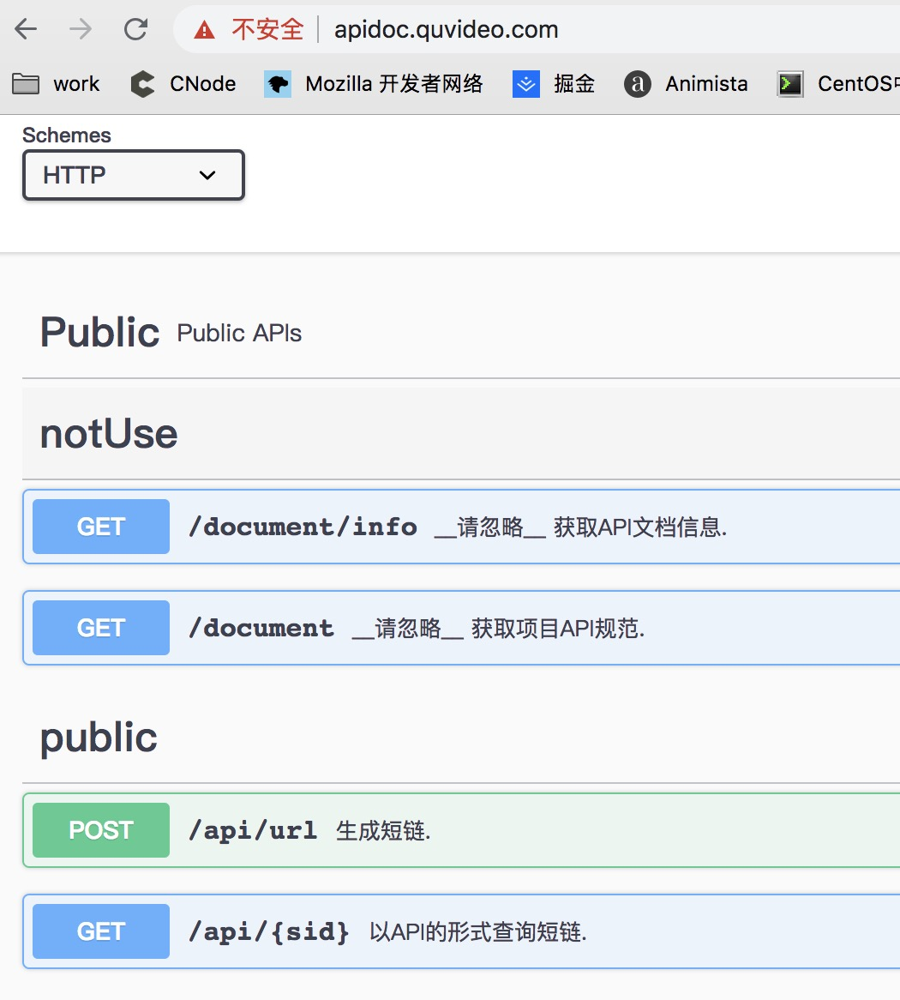

小影短链服务
====


[](http://gitlab.quvideo.com/WEB/url-service/commits/master)
[](http://gitlab.quvideo.com/WEB/url-service/commits/master)


采用 [小影nodejs基础工程][0]、[koa-rest-api-boilerplate][1] 构建

## 常规开始

```bash
# git clone http://gitlab.quvideo.com/WEB/url-service.git
# cd url-service && make init
# 导入 sql 见 [README.md](./README.md) 库表结构
# 初始化安装依赖包
make init 
# 默认 development 环境，可以指定其他环境 make start NODE_ENV=base
make start 
```
## 镜像方式开始

注意：需要开启 docker 

```bash
# 初始化安装依赖包
make init 
# 测试，构建生产环境相关文件
make build
# 打包镜像 (自行改造Makefile：是否推送到 公司阿里云仓库)
make publish
# 本地 运行
make deploy
```

## 单测 与覆盖率

```bash
# 单元测试 （默认 development）
make test-uni 
# 指定环境 文件 
# make test-uni NODE_ENV=test TEST_FILE=tools.test.js
# 代码覆盖率 （默认 development）
make test-cov 
```

## build 与 Docker 发布

可以直接 制作 docker

```bash
# 打包代码
make build
# build 镜像 并 发布镜像到 公司阿里云服务
make publish
```

## 性能测试 _推荐_ [wrk][8] ~~[siege][4]高QPS测试不适合~~

依赖 Mysql

```bash
#brew install wrk
wrk -t16 -c2000 -d30s -T5s --script=./benchmark/wrk.post.lua --latency http://localhost:5000/api/video
wrk -t16 -c2000 -d30s "http://localhost:5000/api/video/1245d6bd-56d9-4553-b37c-ac9b060f36e4"
# brew install siege
# siege -c 100 -r 10 -f ./benchmark/siege-api.txt
#siege -c 100 -t 10s 'http://localhost:5000/url POST urlOrigin=https://vcm.com/bower_components/font-awesome/HELP-US-OUT.txt' -g
# siege -c 100 r -1  'http://localhost:5000/api/url POST <./benchmark/postfile.json'

```
MacBook Pro (13-inch, 2017, Four Thunderbolt 3 Ports) 其他应用都使用情况下:

注：性能测试前需要[关闭](http://gitlab.quvideo.com/WEB/url-service/blob/master/app/common/utils.js#L143) __流控__ ,__API鉴权__ 与 __csrf__ 校验

### 查短链性能 redirect： QPS 3270

```bash
wrk -t10 -c1000 -d20s "http://localhost:5000/0E0xT56fXRG" 
Running 20s test @ http://localhost:5000/0E0xT56fXRG
  10 threads and 1000 connections
  Thread Stats   Avg      Stdev     Max   +/- Stdev
    Latency   297.17ms   40.37ms 540.74ms   84.34%
    Req/Sec   339.09    216.10     1.00k    66.98%
  65697 requests in 20.09s, 23.93MB read
  Socket errors: connect 0, read 312, write 18, timeout 0
Requests/sec:   3270.24
Transfer/sec:      1.19MB
```

### 查短链性能 API： QPS：3426

```bash
wrk -t10 -c1000 -d20s "http://localhost:5000/api/0E0xT56fXRG"
Running 20s test @ http://localhost:5000/api/0E0xT56fXRG
  10 threads and 1000 connections
  Thread Stats   Avg      Stdev     Max   +/- Stdev
    Latency   277.91ms   40.43ms 488.39ms   77.01%
    Req/Sec   355.73    191.52     0.99k    65.82%
  68856 requests in 20.10s, 21.21MB read
  Socket errors: connect 0, read 442, write 66, timeout 0
Requests/sec:   3426.49
Transfer/sec:      1.06MB
```

### 生成短链性能： QPS：2494

```bash
wrk -t10 -c1000 -d20s -T5s --script=./benchmark/wrk.post.lua --latency http://localhost:5000/api/url
Running 20s test @ http://localhost:5000/api/url
  10 threads and 1000 connections
  Thread Stats   Avg      Stdev     Max   +/- Stdev
    Latency   392.99ms   76.99ms 799.02ms   84.16%
    Req/Sec   273.71    204.24   810.00     61.74%
  Latency Distribution
     50%  367.24ms
     75%  416.78ms
     90%  480.65ms
     99%  695.41ms
  50095 requests in 20.08s, 16.48MB read
  Socket errors: connect 0, read 118, write 55, timeout 0
Requests/sec:   2494.84
Transfer/sec:    840.28KB
```
siege 高并发测试不是很准确
~~阿里云开发环境mysql + 本地应用生成短链API测试结果【15w+次写入】：QPS： 99.95，可用性 100%~~
~~`siege -c 100 r -1  'http://localhost:5051/url POST <./benchmark/postfile.json'`~~


## 测试环境访问

https://url.xy/

```host
10.0.32.249 url.xy
```
> 注：测试环境 nginx ssl 密码：123456

## API 文档

采用 swagger-jsdoc 

访问 [http://apidoc.quvideo.com/][5]

输入： `http://url.xy/document`




> [API 规范][9]（采用 业务错误码形式）与各大开发平台类似；
> 报文格式为json：code,message,data
> code 在 20000 时为成功（注意：不论成功失败 http-status-code 都为200）

## [项目结构实践][10]

本项目后续会抽象成 nodejs-web 框架，基于Koa，参考 java-mvc架构设计

```bash
.
├── bin  # 系统可执行文件层
│   └── www  # 用于docker镜像的 ENTRYPOINT 入口 
├── biz  # 业务层 应用的业务函数的复用抽象
│   ├── biz.url.js 
│   └── index.js
├── common # 公共函数层 应用中与业务无关的公共函数
│   ├── mysql.dao.js  # mysql 集成
│   ├── redis.orm.js  # redis 集成
│   └── utils.js  # 公共函数引入
├── config  配置定义
│   ├── index.js
│   └── logger.js  # 日志集成
├── controllers  # 路由服务层
│   ├── ctl.spec.js  # swagger Doc 集成 现在叫做 OpenAPI规范
│   ├── ctl.url.js  # 业务路由
│   ├── ctl.user.js # 业务路由
│   └── index.js
├── dao  # 数据库操作层
│   └── dao.short.js 
├── index.js
├── middlewares  # 中间件函数层
│   ├── errorHandler.js  # 错误处理
│   ├── index.js
│   ├── log.js
│   ├── paramsValidator.js 
│   ├── requestId.js  # 添加链路 的 request id，方便追踪请求bug
│   └── responseHandler.js  # 返回响应格式化
├── router  # 路由注册层
│   ├── index.js
│   └── routes.js 
├── schema  # 请求参数校验定义
│   ├── index.js
│   └── scm.url.js
├── services  # 服务抽象层
│   ├── index.js
│   └── serv.url.js
├── spec  # swagger API 集成
│   ├── definitions.yaml
│   ├── index.js
│   ├── parameters.yaml
│   ├── responses.yaml
│   └── tags.yaml
└── views  # ssr 渲染
    └── index.ejs

```

## 库表结构

mysql 5.6+

采用了[分表策略](http://gitlab.quvideo.com/WEB/url-service/blob/master/app/common/utils.js#L57)

```sql
-- base_short_url_0 ~ 9 分表

DROP TABLE IF EXISTS `base_short_url_0`;

CREATE TABLE `base_short_url_0` (
  `id` bigint(11) unsigned NOT NULL AUTO_INCREMENT COMMENT '逻辑ID',
  `uuid` varchar(64) NOT NULL DEFAULT '' COMMENT '业务ID-短链code',
  `url` text COMMENT 'url源地址encode后',
  `action` bigint(11) unsigned NOT NULL DEFAULT 0 COMMENT '调用次数',
  `c_user_id` varchar(256) NOT NULL DEFAULT '' COMMENT '创建者-标识符',
  `m_user_id` varchar(256) NOT NULL DEFAULT '' COMMENT '修改者-或调用方',
  `invalid` char(1) NOT NULL DEFAULT 'Y' COMMENT '是否有效，默认Y',
  `ctime` timestamp NOT NULL DEFAULT CURRENT_TIMESTAMP COMMENT '记录创建时间',
  `mtime` timestamp NOT NULL DEFAULT CURRENT_TIMESTAMP ON UPDATE CURRENT_TIMESTAMP COMMENT '记录更新时间',
  PRIMARY KEY (`id`) USING BTREE,
  UNIQUE KEY `uniq_uuid` (`uuid`) USING HASH,
  FULLTEXT KEY `url_user` (`url`,`c_user_id`)
) ENGINE=InnoDB DEFAULT CHARSET=utf8mb4 COMMENT='短链存储表';
```

如果是 5.5 或者是 mariadb 注意修改 ctime [因为其限制了只能有一个 timestamp 类型]

```sql
  `ctime` DATETIME NOT NULL COMMENT '记录创建时间'
```

## 业务错误码

```js
20000, '成功'
20001, '参数错误'
20002, '短链code不正确,没有分表序号'
20003, '查询不到数据'
20004, 'Code不符合规范'
20011, `body parse error: ${err}`
20401, `当前时间区间内 创建/解析 短链次数已经用完请等待到时间点 ${new Date(limit.reset)} 后再试`
40041, `子进程执行错误`
50010, '新增数据失败'
```


[0]: http://gitlab.quvideo.com/WEB/xy-f2e-base.git "基础工程"
[1]: https://github.com/posquit0/koa-rest-api-boilerplate "restful API 与 Swagger"
[3]: https://github.com/dylang/shortid "端ID生成工具"
[4]: https://www.joedog.org/siege-manual/ "手册"
[5]: http://apidoc.quvideo.com/ "swagger"
[6]: https://quvideo.worktile.com/drive/5c1c46f7fac8550aed4d2bed/5c925aeb9e78c47af404ecf0 "vcm apollo 接入"
[7]: http://sqlaudit.quvideo.com/ "SQL审核平台"
[8]: https://github.com/wg/wrk "HTTP基准测试工具,高并发测试"
[9]: http://gitlab.quvideo.com/WEB/xy-f2e-base/blob/master/doc/api.md "HTTP RESTful API规范与接口文档编写"
[10]: https://github.com/goldbergyoni/nodebestpractices#1-project-structure-practices "项目结构实践"